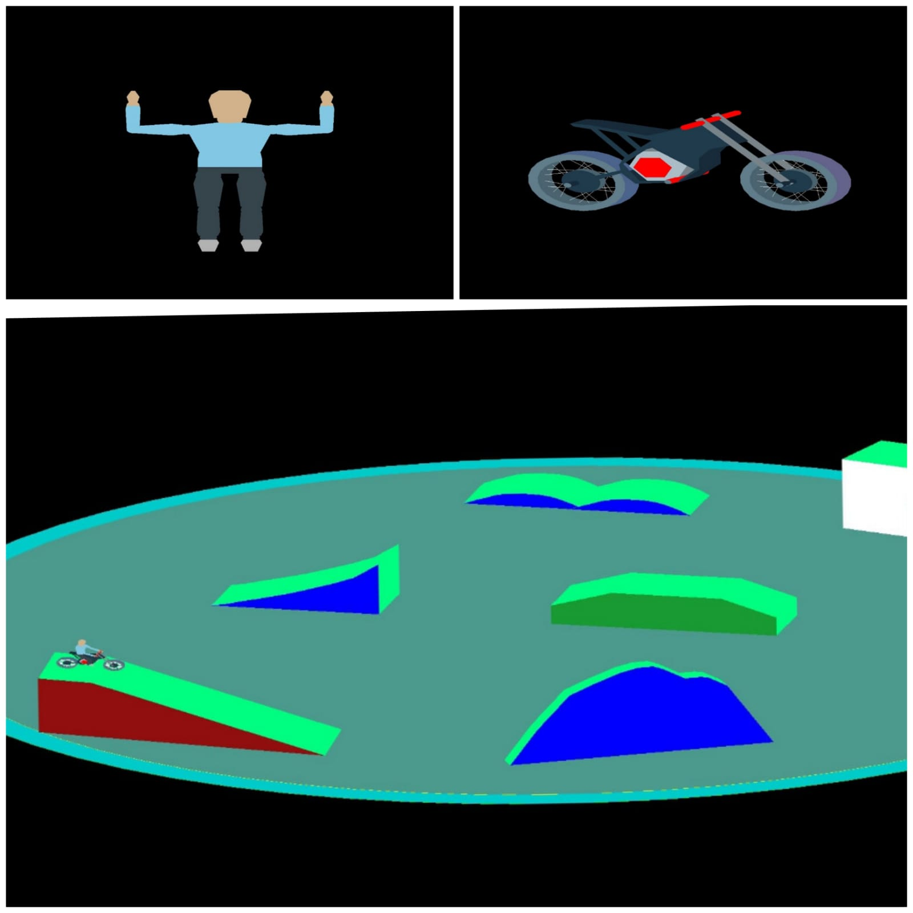

---
title: CS675 2022 - Assignment 2 - FMX Modeling
authors: "Ashutosh Sathe (21q050012), Animesh (21q050015)"
fontsize: 10pt
geometry: 
    - top=1.75cm
    - bottom=1.75cm
    - left=1.5cm
    - right=1.5cm
...

# Declaration

> The entire code of this assignment is purely our own work and we have not taken any assistance from other students or copied the code from internet and at any point of time we both will be able to explain any part of the code that we have written.

1. Ashutosh Sathe (21q050012)
2. Animesh (21q050015)

# Screenshots of rendered models

# Controls

* `Alt + Left/Right` -- Move to the left or the right sibling of current node
* `Alt + Up` -- Move to the parent of the current node
* `Alt + Down` -- Move to the first children of the current node
* Numbers 1 through 6 -- Select a particular degree of freedom of the current node
* Left bracket (`[`) -- Increase the parameter of the selected degree of freedom
* Right bracket (`]`) -- Decrease the parameter of the selected degree of freedom
* Period (`.`) -- Move to the next animation entity (a parameterized hierarchy node)
* Comma (`,`) -- Move to the previous animation entity (a parameterized hierarchy node)
* `m` -- Move the camera farther
* `n` -- Move the camera closer
* `W/A/S/D/Q/E` -- Global camera movement (only track)

# Modeling the rider

Everything in the body is rendered using a special primitive called "Stacked Polygon Prism" (SPP for short). This is simply a set of $n$ concentric $k$-sided regular polygons stacked on top of each other. By varying the radii and heights of these polygons, we can model a variety of shapes. Figure 2 shows how SPP can be used to approximate spheres and cylinders for high enough $n$ and $k$ values. This primitive is implemented in `spprism.hpp` and `spprism.cpp`. SPP, given parameters like $n, k, <r_i>, <h_i>$ and colors at each level will automatically generate the triangle list to be drawn.

Hierarchy structure of the rider is shown in Figure 3. Each part here is an SPP that we manually set the parameters for. Each node in the hierarchy is represented by a structure called `HierarchyNode` (implemented via `hnode.hpp` and `hnode.cpp`) and holds the list of triangles and lines to be drawn for that particular primitive. Triangle list is automatically obtained from SPP for modeling the rider and line list is always empty. We are using `Triangle` and `Point` datatypes from first assignment which have a lot of helper functions to make this job easy.

With the geometry defined as above, we store the relative transform of the current node with respect to its parent node in `local_transform`. This allows us to correctly place a particular node in the world using hierarchy. In addition to this local arrangement transform, we also store a private transform that will not be passed down the hierarchy for additional effects which can be useful during animation. Finally the degrees of freedom for this node are also stored in a fairly flexible manner using `dof_params`, `n_dof`, `dof_deltas` and `dof_limits`. This gives every node up to 3 arbitrary rotational and translational degrees of freedom. All these can be about any arbitrary axis and should be properly configured by the user according to node properties.

In our model of the rider, only the joints have degrees of freedom while every other node such as head, upper arm etc. has 0 degrees of freedom (`n_dof = 0`), these nodes only move with the joints. In our experiments, this enabled much more fluid and natural looking movement as opposed to merging these nodes with joints themselves. Notice that for successful execution, the generated executable `a2-model-rider` must be executed from the folder containing the parameters of various SPPs (i.e. folder containing `body_parts` directory) used for modeling the rider.

# Modeling the bike

Modeling the bike body was challenging due to its irregular shape. We first drew left hand side view of the bike on a graph paper. Labeled each point and then manually generated triangles for this side. Then we ported these triangles into OpenGL and kept transforming it till we were happy with the overall shape of one side. Then we simply reflected the shape about Z-axis to get the complete body. Other parts of the bike were modeled using SPP. Figure 4 shows the overall hierarchy structure. Similar to rider, for successful execution, the generated executable `a2-model-bike` must be executed from the folder containing the parameters of various SPPs (i.e. folder containing `bike_parts` directory) used for modeling the bike.

# Modeling the track

Similar to bike body, we drew obstacles on graph paper, labeled each point and generated triangles foe each side. Then we ported them to OpenGL and applied transformations to get the final track. We have roughly scaled the obstacles to be sensible with respect to bike and the rider, however, we will finetune the scale of bike + rider combo a bit before next assignment depending on how it looks through the camera. A lot more detail in the arena -- such as the actual path that bike follows, roughness of the surfaces etc. will be brought via textures and lighting in the next assignment.

# References

* OpenGL Tutorials -- Tutorial 07 -- [`https://github.com/paragchaudhuri/cs475-tutorials`](https://github.com/paragchaudhuri/cs475-tutorials)
* Hierarchical Modeling -- [`http://graphics.cs.cmu.edu/nsp/course/15-462/Spring04/slides/05-hierarchy.pdf`](http://graphics.cs.cmu.edu/nsp/course/15-462/Spring04/slides/05-hierarchy.pdF)
* Enabling `glVertexAttribPointer` such that could make arranging a single VBO for hierarchical modeling easy -- [`https://stackoverflow.com/a/39684775`](https://stackoverflow.com/a/39684775)
* Track obstacle inspiration -- [`https://www.youtube.com/watch?v=VC1FeM9QuEg`](https://www.youtube.com/watch?v=VC1FeM9QuEg)
